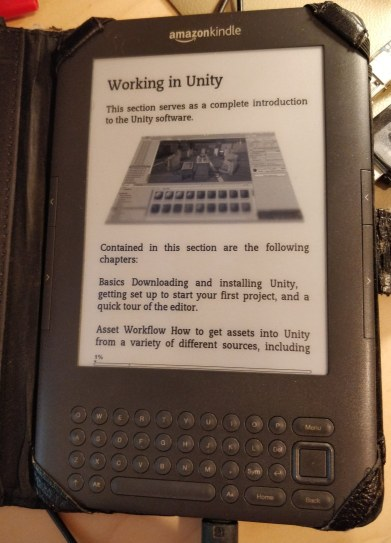
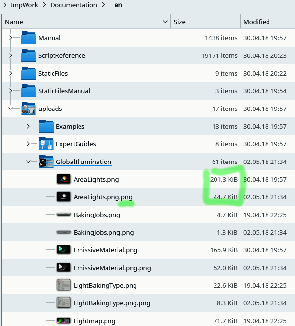

# Unity manual to eBook

Steps and a script to reformat the Unity3d user manual to an eBook-friendly html file.



## Download the offline manual

Download the offline documentation from the unity3d page. For example: [2018.2](https://docs.unity3d.com/2018.2/Documentation/Manual/OfflineDocumentation.html)

```bash
 wget https://docs.unity3d.com/2018.1/Documentation/uploads/UnityDocumentation.zip
 unzip UnityDocumentation.zip -d /tmp/unity/
 cd /tmp/unity/Documentation/en
```

## Convert images

**This is an optional step**. Not needed if you are using a device with full capable web browser.

There are `jpg`, `png`, `gif`, `svg` and `pdf` files included in the manual. I wanted all the images to be grayscale png files for my Kindle reader.

Convert `svg` with the [Inkscape](https://inkscape.org):

```bash
find . -name "*.svg" -exec inkscape -z -e {}.png {} \;
 ```

Convert `jpg` with [ImageMagic's](https://www.imagemagick.org/script/index.php) `convert`:

```bash
find . -name "*.jpg" -exec convert -verbose {} {}.png \;
```

The same for the `gif`s. Since the `gif` files are animated the `convert` will create multiple numbered `png` 
files for each frame. The Groovy script can deal with this but it takes only one frame from the animation.

```bash
find . -name "*.gif"  -exec convert -verbose {} {}.png \;
```

Convert all the pngs to grayscale with the [pngcrush](https://pmt.sourceforge.io/pngcrush/).

```bash
find . -name "*.png" -exec pngcrush -brute -l 9 -rem gAMA -rem cHRM -rem iCCP -rem sRGB -rem alla -rem text -c 0 {} {}.png \;
```

As an alternative the `mogrify` from the ImageMagic can be used too. But it would produce bigger images.
The the `pngcrush` is slow. It takes more than 30 minutes to convert all the `pngs` on an average pc. But the resulted images (after bit-depth reduction and grayscale) are `3x-5x` times smaller.

```bash
#find . -name "*.png" -exec mogrify -verbose -type Grayscale -depth 8 -quality 9 -format png {}  \;
```

Note all the above commands (except the last one ) will produce a copy of the file with multiple extensions.
Like `foobar.svg.png.png`. The Groovy script updates all the image links while prefering the longest file name.
So the `foobar.svg.png.png` will be used instead of the original `foobar.svg`



## Run the Groovy script

The `ManualProcessor.groovy` script:

- Parses the TOC file to recognize order of the pages .
- Linearizes and removes unnecessary content from each page.
- Concatenate multiple pages into single `html` file.
- For each first level chapter creates a new `html` file.
- Makes sure there are not too many pages in single chapters file.
- Add number prefix for each file so the order is obvious.
- Unsure the img links are correct after above image conversation.


To get the script simply clone this repo or just:

```bash
wget https://raw.githubusercontent.com/Premik/UnityManualEbook/master/ManualProcessor.groovy 
```

- Get and install [Groovy](http://groovy-lang.org/)
- Review the Groovy script. At the top there is `Param` class. If you are going to use a web-browser for reading set the `removeLocalUrlLinks = false` to keep the local links.
- Run the script inside the unziped folder `Documentation/en/`:

```bash
groovy UnityManual.groovy
```
It will produce a new **Manual-flattened** folder with the linearized html files beside the original 'Manul' folder:

 * `Manual`
 * **Manual-flattened**
   * `01-UnityManual-partA-UnityManual.html`
   * `02-UnityOverview-partA-UnityOverview.html`
   * `02-UnityOverview-partB-AssetStore.html`
   * `02-UnityOverview-partC-PresetLibraries.html`
   * `03-ImportingAssets-partA-ImportingAssets.html`
   * `...`
 * `ScriptReference`
 * `StaticFiles`
 * `StaticFilesManual`
 * `upload`

 ## Calibre
- In the [Calibre](https://calibre-ebook.com/) import all the `html` files as individual books. Or just drag them to the library view.
- Convert them to the desired format. I used `AZW3` aka `KF8` for my Kindle as the Mobi format had problems placing the images on proper location. 
- The total size of the User Manul in the `AZW3` format in may case was slightly over `90MB`.
## Limitation
- Current the process doesn't work for the ScriptingManual. Probably the html structure is slightly different to the User Manual one so the script removes too much. Perhaps I'll fix this once I'm done reading the User manual..